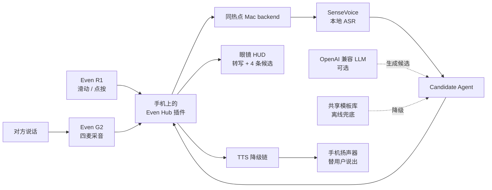

<div align="center">

# 无声之声

### Voice for the Voiceless

**让每一个想表达的人，都能自己选择如何被听见。**

[AdventureX 2026](https://adventure-x.org/zh) Hackathon Project<br>
Even G2 智能眼镜 · Even R1 戒指 · AI 沟通辅助

</div>

> AdventureX 说：“如果你有梦，请大声地把它说出来。”
>
> **可如果“说出来”本身，就是一道门槛呢？**

无声之声是一套面向沟通障碍的可穿戴表达辅助原型。眼镜把对方的话转成
可读文字，并生成 4 条简短候选表达；用户通过戒指自主选择，设备再从手机
扬声器说出口。

**AI 不替用户决定说什么，只帮助用户更容易地表达自己。**

---

## 我们为什么做它

对很多人来说，对话是一件自然发生的事。但对另一些人来说，实时交流像一场
没有暂停键的考试：

- 有人知道自己想说什么，却因构音困难或言语障碍一次次被要求重复；
- 有人在压力和陌生场景中难以开口，等组织好语言时，对话已经过去；
- 有人的思维与表达节奏不同，需要多一点时间把想法变成一句话；
- 有些聋人和听障人士需要先看见对方说了什么，才能参与当下的交流。

手机打字会让目光离开对方，传统语音助手又默认用户能够流畅说出指令。我们想
做的是一条更自然的沟通通道：**眼镜负责看见上下文，戒指负责表达选择，AI
负责缩短从“我想说”到“我说出来”的距离。**

这不是一个医疗诊断或治疗工具，也不试图替代手语、专业字幕、人工翻译或现有
辅助沟通方案。它是一次关于“沟通能否更有选择、更少压力”的产品实验。

## 它为谁而设计

| 使用者与场景 | 无声之声提供的帮助 |
|---|---|
| 言语表达受限、少语或使用非口语沟通方式的人 | 用候选短句与 TTS 补充一条表达通道 |
| 构音困难、容易被误解或不便重复表达的人 | 选择后由设备清晰说出内容 |
| 在即时社交中难以组织语言的人 | 根据当下对话提供简短、可修改方向的表达候选 |
| 神经多样性人群及需要更多反应时间的人 | 降低临场组织语言的时间压力 |
| 聋人和听障人士 | 在 HUD 查看语音转写，辅助理解正在发生的对话 |
| 临时失声、嘈杂环境或高压力场景中的任何人 | 在短时间内获得替代性的输入与输出方式 |

我们避免用“聋哑人”或“特殊人群”概括不同的人。听觉、言语和社交表达需求
并不相同，最终产品也应由真实使用者参与定义。

## 一次对话如何发生

1. **开始聆听**：用户轻点戒指，眼镜只在这一小段时间开启麦克风；
2. **看见对话**：本地 SenseVoice ASR 将对方的话转成文字；
3. **获得候选**：Candidate Agent 结合场景、个人偏好和最近对话生成固定
   4 条、每条不超过 12 个字的表达；
4. **自主选择**：用户滑动戒指浏览候选，点按确认，也可以双击换一组；
5. **替用户说出**：手机扬声器播放选中的表达，HUD 同步显示确认结果；
6. **随时退出**：迟到响应会被丢弃，看门狗会复位卡住的流程，发声时麦克风
   保持关闭。

```text
对方：“你觉得这个方案怎么样？”

HUD：
  听到：你觉得这个方案怎么样？
  ❯ ① 我很喜欢
    ② 我想再看看
    ③ 可以具体说说吗
    ④ 给我一点时间

滑动选择 → 点按确认 → 手机说出：“我想再看看”
```

## 为什么是眼镜与戒指

- **不把人藏在手机后面**：文字和候选出现在视线内，交流时仍能看着对方；
- **不要求再次开口**：戒指提供安静、低动作幅度的选择方式；
- **让对方真正听见**：眼镜没有扬声器，手机外放反而天然面向谈话对象；
- **让停顿变得可理解**：HUD 状态和交互反馈把“我正在组织表达”变成清晰信号。

## 系统架构



### Demo 设备分工

| 设备 | 职责 |
|---|---|
| 👓 Even G2 眼镜 | 四麦采音、HUD 显示、镜腿紧急操作 |
| 💍 Even R1 戒指 | 开始聆听、候选导航、确认和换批 |
| 📱 手机 / Even Hub 插件 | 状态机、配置、请求编排、本地 KVS、TTS 播放 |
| 💻 同热点 Mac backend | 本地 ASR、候选 Agent、LLM/TTS 编排、行为记忆 |

当前黑客松 Demo 的 backend 仍运行在同一 Wi-Fi 或热点下的 Mac 上；未来部署为
稳定 HTTPS 服务后，笔记本才可以移出演示链路。

## 已经跑通的核心能力

- `IDLE → LISTENING → THINKING → CANDIDATES → SPEAKING` 完整状态机；
- Even G2 采音、HUD 多状态界面和 R1 / 镜腿输入事件；
- 本地 SenseVoice 中英日韩粤语音识别；
- 固定 4 条、每条不超过 12 字的候选生成与确定性清洗；
- 应答、主动快捷表达、换一批和紧急呼救模式；
- LLM 失败时走 backend 模板，backend 不可达时走插件内置模板；
- 云 TTS → 浏览器本机语音 → 静默提示的分层降级；
- 可暂停、清除的频次学习、短期上下文和持久行为记忆；
- 纯浏览器键盘模拟，可在没有眼镜时完成大部分开发联调。

## 我们坚持的产品原则

### 1. 用户拥有最后一句话

AI 只提供候选，未经用户确认不会自动代说。避免用词、语气、常用表达和紧急
文本都由用户配置。

### 2. 麦克风不是常开

只有用户主动触发的 `LISTENING` 窗口采音；进入 `SPEAKING` 后不开麦，既减少
无关采集，也从状态机上避免设备听到自己的声音。

### 3. 学习必须可控

个性化学习默认可用，但用户可以暂停并清除本地和 backend 记忆。关闭后不再
累计频次、对话历史或反馈。

### 4. 失败时仍然能表达

网络、LLM 或 TTS 失败不应让用户突然失去沟通能力。共享模板、插件端兜底、
本机语音与固定紧急文本组成了 Demo 的降级链。

### 5. 对能力边界保持诚实

无声之声目前是黑客松原型，不是医疗器械，不承诺治疗任何疾病，也不能覆盖
所有聋人、听障人士或言语障碍者的沟通偏好。产品继续演进前，需要与真实使用者
和无障碍领域专业人士共同测试。

我们参考了
[WHO 关于聋人和听障人士友好沟通的建议](https://www.who.int/news-room/questions-and-answers/item/how-to-be-hearing-loss-friendly)
及
[联合国无障碍沟通指南](https://www.un.org/sites/un2.un.org/files/disability-inclusive_communications_guidelines_-_march_2022.pdf)，
但这些原则不能代替真实用户参与。

## AdventureX：把 AI 从聊天框带进真实对话

AdventureX 鼓励创造者在短时间内把大胆想法变成能够被看见、被体验的产品。
我们选择解决的不是“如何让 AI 更会说话”，而是：

> **如何让 AI 帮助更多人保有表达的主动权？**

这次构建的重点不是再做一个聊天 App，而是完成一条真实的物理交互闭环：

```text
听见现实世界 → 理解当下语境 → 给出有限选择 → 由人做决定 → 回到现实世界
```

两个人、三天、一副眼镜、一枚戒指。我们希望证明：无障碍设计不只是功能清单，
也可以是自然、克制、真正融入日常交流的产品体验。

## 快速开始

### 环境要求

- Node.js 18+
- npm
- 可选：Even G2 + R1；没有硬件时可使用浏览器和 Even Hub Simulator
- 完整 `/asr` 链路需要约 1.1 GB 的 SenseVoice 模型

### 安装与启动

```bash
npm install
cp backend/env.example backend/.env
```

`backend/.env` 中可填写 OpenAI 兼容的 `LLM_API_KEY`；留空时 `/candidates`
自动使用模板库，不会阻塞 Demo。ASR 模型下载方式见
[backend/models/README.md](backend/models/README.md)。

分别启动 backend 和眼镜插件：

```bash
npm run dev:backend
npm run dev:glasses
```

浏览器开发模式下，按 **Enter** 开始聆听，使用方向键、空格和 Esc 模拟戒指。

### 真机 Demo

眼镜、手机和 Mac 必须连接同一 Wi-Fi 或热点。打包时显式传入 Mac 局域网地址：

```bash
npm run demo:pack -- --backend-url http://<Mac-IP>:8787
```

> 当前 backend 无鉴权并允许跨域，只适合可信局域网 Demo，请勿直接映射到公网。

### 验证

```bash
npm test
npm run typecheck
```

## 仓库结构

```text
├── shared/        三端接口契约、候选约束和共享模板库
├── backend/       Express API、ASR、候选 Agent、TTS 与 SQLite 记忆
├── glasses-app/   Even Hub 插件、状态机、HUD、戒指输入和手机配置页
├── docs/          项目方案、接口契约和联调指南
└── content/       Build in Public 文稿与媒体素材
```

根目录是 npm workspaces monorepo。接口结构以 `@vftv/shared` 为单一真相源；
修改 API 时应先更新共享类型和 [接口契约](docs/接口契约.md)。

更多资料：

- [项目方案与可行性评估](docs/无声之声-项目方案.md)
- [接口契约](docs/接口契约.md)
- [联调指南](docs/联调指南.md)
- [glasses-app 开发说明](glasses-app/README.md)
- [backend 开发说明](backend/README.md)

## 许可证

除下述例外，本仓库的软件源代码和技术文档依据
[Apache License 2.0](LICENSE) 授权。

- `content/` 下的运营文稿、图片及其他媒体素材不在 Apache-2.0
  授权范围内；相关权利归各自权利人所有，使用前需另行取得许可。
- 第三方依赖、SDK、模型及服务仍适用其各自的许可证和使用条款。
- Apache-2.0 不授予项目名称、标识或商标的使用权。
